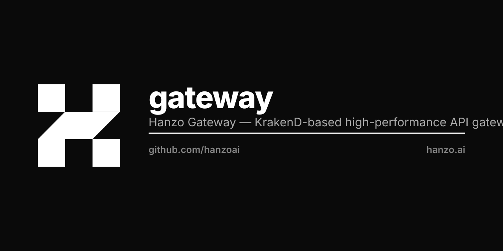

<p align="center"></p>

# gateway

HTTP gateway: routing, JWT validation, identity strip + write, rate limit, circuit break, telemetry.

[]()
[]()

## Quick start

```bash
docker run -p 8080:8080 ghcr.io/hanzoai/gateway:latest
```

## Build dependency: `GOEXPERIMENT=jsonv2`

The HIP-0106 in-process gateway mount runs on `hanzoai/zip`, which
routes every JSON path through stdlib `encoding/json/v2` when the
binary is compiled with `GOEXPERIMENT=jsonv2`. Shipped Dockerfile +
CI workflow set the flag; manual builds should do the same:

```bash
GOEXPERIMENT=jsonv2 make build
```

Without the experiment the binary still builds and runs - zip falls
back to `encoding/json` v1. v2 is preferred for production: ~10%
faster on the edge, ~25% fewer allocations per request. The mount
startup log line `json_variant=encoding/json/v2` confirms it is
active.

No third-party JSON library is allowed in the Hanzo Go stack - stdlib
only (HIP-0106 canonical Hanzo Go stack).

## What this is

`gateway` is the unified API entry point for the Hanzo platform. Behind `hanzoai/ingress` (L7 TLS), in front of every Hanzo backend service. Validates JWTs against Hanzo IAM JWKS, strips every client-supplied identity header (`X-User-*`, `X-Org-Id`, ...), writes the three canonical identity headers from the JWT, then forwards in-process (when co-resident under `hanzoai/cloud`) or over the wire to downstream services.

## Specs

Implements:
- HIP-0026 IAM (identity-header contract)
- HIP-0106 Unified Cloud Binary (gateway subsystem — already exposes `Mount()`)

## Architecture

```
   Internet  ->  hanzoai/ingress (TLS, L7)  ->  hanzoai/gateway
                                                    |
                                          JWT validation (IAM JWKS)
                                                    |
                          strip client X-* identity headers (unconditional)
                                                    |
                          write X-User-Id / X-Org-Id / X-Roles from JWT
                                                    |
                          rate-limit, circuit-break, telemetry
                                                    |
                          in-process route to cloud subsystems
                                          OR
                          over-the-wire to standalone services
```


---

# Hanzo Gateway

High-performance API gateway for Hanzo AI services. Routes 147+ API endpoints across production clusters with rate limiting, authentication forwarding, CORS, circuit breakers, and telemetry -- all driven by declarative JSON configuration.

[](https://github.com/hanzoai/gateway/actions/workflows/deploy.yml)
[](https://go.dev)
[](https://github.com/hanzoai/gateway/blob/main/LICENSE)
[](https://github.com/hanzoai/gateway/pkgs/container/gateway)

## Overview

Hanzo Gateway is the unified API entry point for all Hanzo platform traffic. It sits behind [Hanzo Ingress](https://github.com/hanzoai/ingress) (L7 reverse proxy) and routes requests to internal services with per-endpoint rate limiting, header forwarding, and circuit breaker protection.

| Cluster | Domain | Endpoints | Rate Limit (global) | Rate Limit (per IP) |
|---------|--------|-----------|---------------------|---------------------|
| **hanzo-k8s** | `api.hanzo.ai` | 133 | 5,000 req/s | 100 req/s |

The gateway can also be deployed independently by other organizations with their own configuration.

For full documentation, see [docs.hanzo.ai/docs/services/gateway](https://docs.hanzo.ai/docs/services/gateway).

## Architecture

```
                    Internet
                       |
              +--------+--------+
              |  Cloudflare CDN |
              +--------+--------+
                       |
              +--------+---------+
              | Hanzo Ingress    |
              | (L7 TLS/routing) |
              +--------+---------+
                       |
              +--------+---------+
              | Hanzo Gateway    |
              | 133 endpoints    |
              +---+----+----+----+
                  |    |    |
               Cloud  IAM  Commerce
               API         API
```

## API Endpoints

### OpenAI-Compatible LLM Routes (`api.hanzo.ai`)

These endpoints are fully compatible with the OpenAI API format. Point any OpenAI SDK client at `https://api.hanzo.ai` and it works out of the box.

| Method | Path | Backend | Description |
|--------|------|---------|-------------|
| `POST` | `/v1/chat/completions` | cloud:8000 | Chat completions (streaming and non-streaming) |
| `POST` | `/v1/completions` | cloud:8000 | Text completions |
| `POST` | `/v1/messages` | cloud:8000 | Anthropic Messages API compatibility |
| `GET` | `/v1/models` | cloud:8000 | List available models |
| `POST` | `/v1/embeddings` | cloud:8000 | Text embedding generation |
| `POST` | `/v1/images/generations` | cloud:8000 | Image generation |
| `POST` | `/v1/audio/transcriptions` | cloud:8000 | Audio transcription (Whisper) |
| `POST` | `/v1/audio/speech` | cloud:8000 | Text-to-speech synthesis |
| `POST` | `/v1/zap` | cloud:8000 | Hanzo Zap (structured extraction) |
| `POST` | `/v1/async-invoke` | cloud:8000 | Async inference (long-running jobs) |
| `GET` | `/v1/async-invoke/{id}/status` | cloud:8000 | Poll async job status |
| `GET` | `/v1/async-invoke/{id}` | cloud:8000 | Retrieve async job result |

### Platform Service Routes (`api.hanzo.ai`)

All platform routes are available at both `/{service}/*` and `/v1/{service}/*`.

| Path prefix | Backend | Description |
|-------------|---------|-------------|
| `/auth/*` | iam:8000 | IAM, authentication, OAuth |
| `/cloud/*` | cloud:8000 | Cloud API (projects, deployments) |
| `/commerce/*` | commerce:8001 | Commerce (orders, payments, products) |
| `/analytics/*` | analytics | Unified analytics and events |
| `/billing/*` | billing | Usage metering and invoicing |
| `/console/*` | console | Admin console API |
| `/agents/*` | agents | Agent orchestration |
| `/search/*` | search | AI-powered search |
| `/vector/*` | vector | Vector database operations |
| `/operative/*` | operative | Computer-use automation |
| `/bot/*` | bot | Bot framework (REST + WebSocket) |
| `/kms/*` | kms | Key management service |
| `/platform/*` | platform | PaaS deployment API |
| `/functions/*` | functions | Serverless functions |
| `/web3/*` | web3 | Web3 and blockchain APIs |
| `/pricing/*` | pricing | Model pricing and rate cards |
| `/pricing/model/{name}` | pricing | Single model price lookup |

### Monitoring Endpoints

| Path | Description |
|------|-------------|
| `/__health` | Gateway health check (port 8080) |
| `/health` | Application health check |
| `/pubsub/healthz` | PubSub health |
| `/pubsub/varz` | PubSub variables / metrics |
| `/pubsub/connz` | PubSub connections |
| `/pubsub/subsz` | PubSub subscriptions |
| `/pubsub/jsz` | PubSub JetStream |

## Model Routing

Hanzo Gateway proxies all LLM requests through the Hanzo Cloud API (`cloud`), which handles model routing, load balancing, and provider selection. The gateway itself is provider-agnostic -- it forwards authenticated requests and streams responses back to the client.

### How It Works

```
Client                Gateway              Cloud API            Provider
  |                      |                     |                    |
  |-- POST /v1/chat ---->|                     |                    |
  |   model: "zen4"      |-- forward --------->|                    |
  |                      |                     |-- route to tier -->|
  |                      |                     |   (Fireworks)      |
  |<---- streaming ------|----- streaming -----|<--- streaming -----|
```

1. The client sends a request to `api.hanzo.ai/v1/chat/completions` with a `model` field.
2. The gateway forwards the request (with all auth headers) to the Cloud API backend.
3. The Cloud API resolves the model name to a provider and endpoint based on the model's tier and availability.
4. Responses stream back through the gateway to the client with no buffering.

### Model Tiers

| Tier | Models (examples) | Provider | Notes |
|------|-------------------|----------|-------|
| **Free** | `zen3-nano`, `zen4-mini` | Hanzo DO cluster | Best-effort, rate-limited |
| **Standard** | `zen4-pro`, `zen3-vl`, `zen4-coder-flash` | Fireworks, Together | Low latency, high availability |
| **Premium** | `zen4`, `zen4-max`, `zen4-ultra` | Fireworks | Dedicated capacity, highest throughput |
| **Third-party** | `gpt-4o`, `claude-sonnet-4-20250514`, `gemini-2.5-pro` | OpenAI, Anthropic, Google | Pass-through with unified billing |

The gateway does not need to know about model tiers -- it passes all requests to the Cloud API, which handles routing logic, fallback, and retries. Model availability is returned by `GET /v1/models`.

## Authentication

All requests to `api.hanzo.ai` require a valid API key. Keys are issued through the [Hanzo Console](https://console.hanzo.ai) and scoped to a project.

### API Key Authentication

Pass your API key in the `Authorization` header using the Bearer scheme:

```bash
curl https://api.hanzo.ai/v1/chat/completions \
  -H "Authorization: Bearer hk_live_..." \
  -H "Content-Type: application/json" \
  -d '{
    "model": "zen4-pro",
    "messages": [{"role": "user", "content": "Hello"}]
  }'
```

### Auth Flow

```
Client --> Gateway --> Cloud API --> IAM (hanzo.id)
                                        |
                                    Validate key
                                    Resolve org/project
                                    Check rate limits
                                    Return user context
```

The gateway validates bearer JWTs against IAM (`hanzo.id`) using JWKS and re-emits the canonical 3 identity headers. Opaque API keys (`hk-`, `sk-`, `fw_`, `hz_`, `pk-`) pass through to the backend services for validation.

### Header Forwarding

After JWT validation, the gateway emits exactly three canonical identity headers to downstream services and strips every other vendor/legacy variant on ingress:

- `X-User-Id` -- user ID from JWT `sub` claim
- `X-Org-Id` -- org slug from JWT `owner` claim
- `X-Roles`  -- comma-joined role names from JWT `roles` claim

Auxiliary headers emitted by the gateway (derivatives of the JWT):

- `X-User-Email` -- email from JWT `email` claim
- `X-Phone-Number` -- phone from JWT `phone_number`/`phone` claim
- `X-User-IsAdmin` -- `"true"` when the JWT asserts `isAdmin`

Standard passthrough headers:

- `Authorization` -- Bearer token or API key
- `Content-Type` -- Request body encoding
- `Accept` -- Response format preference
- `X-Request-ID` -- Client-provided request tracing ID

Headers stripped unconditionally on ingress (never trusted from clients): `X-User-Id`, `X-Org-Id`, `X-Roles`, `X-User-Email`, `X-Phone-Number`, `X-User-IsAdmin`, `X-User-Role`, `X-User-Roles`, `X-User-Name`, `X-Tenant-Id`, `X-Org`, and every `X-IAM-*` / `X-HANZO-*` variant.

## Rate Limiting

The gateway enforces rate limits at two levels: global (across all clients) and per-client (by IP address).

### Global Configuration

```json
{
  "extra_config": {
    "qos/ratelimit/router": {
      "max_rate": 5000,
      "client_max_rate": 100,
      "strategy": "ip"
    }
  }
}
```

| Parameter | Description | Default |
|-----------|-------------|---------|
| `max_rate` | Total requests/second across all clients | 5,000 |
| `client_max_rate` | Requests/second per client IP | 100 |
| `strategy` | Client identification method | `ip` |

### Per-Endpoint Overrides

Individual endpoints can override the global limits. This is useful for high-traffic inference routes or sensitive administrative endpoints:

```json
{
  "endpoint": "/v1/chat/completions",
  "method": "POST",
  "extra_config": {
    "qos/ratelimit/router": {
      "max_rate": 10000,
      "client_max_rate": 50,
      "strategy": "ip",
      "every": "1s"
    }
  }
}
```

The `every` field sets the time window for the rate counter. Default is `"1s"` (per second). Set to `"1m"` for per-minute limits.

### Rate Limit Responses

When a client exceeds their rate limit, the gateway returns:

```
HTTP/1.1 429 Too Many Requests
Content-Type: application/json

{"message": "rate limit exceeded"}
```

## Observability

### Logging

Structured logging is enabled by default with the `[GATEWAY]` prefix:

```json
{
  "extra_config": {
    "telemetry/logging": {
      "level": "INFO",
      "prefix": "[GATEWAY]",
      "syslog": false,
      "stdout": true
    }
  }
}
```

Log levels: `DEBUG`, `INFO`, `WARNING`, `ERROR`, `CRITICAL`.

### Health Check

```bash
# Gateway health (always returns 200 when the process is up)
curl http://localhost:8080/__health

# Application health (checks backend connectivity)
curl https://api.hanzo.ai/health
```

### Metrics

The gateway exposes Prometheus-compatible metrics for scraping. Key metrics include:

- Request count by endpoint and status code
- Response latency histograms
- Backend connection pool utilization
- Circuit breaker state transitions
- Rate limiter rejection counts

### Circuit Breakers

Backend failures are automatically isolated. When a backend exceeds the error threshold, the circuit opens and requests are rejected immediately until the backend recovers. This prevents cascade failures across services.

## Quick Start

### Build from Source

```bash
# Build gateway binary
make build

# Build ingress sidecar binary
make build-ingress

# Run tests
make test

# Validate all configs
make validate
```

### Run Locally

```bash
# Run with default config
./gateway run -c configs/hanzo/gateway.json
```

### Docker

```bash
# Pull and run the latest image
docker run -p 8080:8080 ghcr.io/hanzoai/gateway:latest

# Build from source
make docker
```

### Docker Compose

```yaml
services:
  gateway:
    image: ghcr.io/hanzoai/gateway:latest
    ports:
      - "8080:8080"
    volumes:
      - ./configs/hanzo/gateway.json:/etc/gateway/gateway.json:ro
    healthcheck:
      test: ["CMD", "wget", "-qO-", "http://localhost:8080/__health"]
      interval: 10s
      timeout: 3s
      retries: 3
    restart: unless-stopped
```

Save as `compose.yml` and run:

```bash
docker compose up -d
```

## Production Deployment

Hanzo Gateway runs on the `hanzo-k8s` DOKS cluster (`do-sfo3-hanzo-k8s`) in the `hanzo` namespace. Continuous deployment is handled by GitHub Actions -- every push to `main` builds a new image, applies the ConfigMap, and performs a rolling restart.

### Deploy

```bash
# Apply config and restart pods
make deploy-hanzo

# Check status
make status

# Tail logs
make logs-hanzo
```

### Infrastructure Details

| Property | Value |
|----------|-------|
| **Image** | `ghcr.io/hanzoai/gateway:latest` |
| **Replicas** | 2 |
| **Service type** | ClusterIP (behind Ingress) |
| **Namespace** | `hanzo` |
| **K8s context** | `do-sfo3-hanzo-k8s` |
| **Health check** | `GET /__health` :8080 |
| **CI/CD** | GitHub Actions (deploy.yml) |

### K8s Manifests

```
k8s/
  hanzo/
    deployment.yaml     # Gateway deployment (2 replicas)
    service.yaml        # ClusterIP service
    ingress.yaml        # Ingress resource for api.hanzo.ai
```

## Configuration

All routing is defined in JSON configuration files. Each cluster has its own config.

### Editing Routes

1. Edit the config file:
   ```bash
   $EDITOR configs/hanzo/gateway.json
   ```

2. Validate the config:
   ```bash
   make validate
   ```

3. Deploy:
   ```bash
   make deploy-hanzo
   ```

The Makefile creates a ConfigMap from the JSON file and triggers a rolling restart.

### Config Structure

```json
{
  "version": 3,
  "name": "Hanzo API Gateway",
  "port": 8080,
  "timeout": "120s",
  "extra_config": {
    "router": {
      "return_error_msg": true
    },
    "qos/ratelimit/router": {
      "max_rate": 5000,
      "client_max_rate": 100,
      "strategy": "ip"
    },
    "telemetry/logging": {
      "level": "INFO",
      "prefix": "[GATEWAY]",
      "stdout": true
    }
  },
  "endpoints": [
    {
      "endpoint": "/v1/chat/completions",
      "method": "POST",
      "input_headers": ["*"],
      "output_encoding": "no-op",
      "backend": [{
        "url_pattern": "/api/chat/completions",
        "host": ["http://cloud.hanzo.svc.cluster.local:8000"],
        "encoding": "no-op"
      }]
    }
  ]
}
```

## Repository Structure

```
configs/
  hanzo/
    gateway.json        # Hanzo API Gateway config (133 endpoints)
    ingress.json        # Hanzo Ingress sidecar config
k8s/
  hanzo/                # K8s manifests for hanzo-k8s cluster
cmd/
  gateway/              # Gateway binary entry point
  ingress/              # Ingress sidecar binary entry point
tests/                  # Integration tests
Dockerfile              # Multi-stage build (Go 1.25 + Alpine 3.23)
Makefile                # Build, test, validate, deploy commands
```

## DNS

| Domain | Path | Target |
|--------|------|--------|
| `*.hanzo.ai` | Cloudflare | hanzo-k8s LB -> Ingress -> Gateway |

## Related Projects

Hanzo Gateway is one of four products in the Hanzo AI infrastructure stack:

| Product | Role | Repository |
|---------|------|------------|
| [**Hanzo Ingress**](https://github.com/hanzoai/ingress) | L7 reverse proxy, TLS termination, load balancing | `hanzoai/ingress` |
| [**Hanzo Gateway**](https://github.com/hanzoai/gateway) | API gateway, rate limiting, endpoint routing | `hanzoai/gateway` |
| [**Hanzo Engine**](https://github.com/hanzoai/engine) | GPU inference engine, model serving | `hanzoai/engine` |
| [**Hanzo Edge**](https://github.com/hanzoai/edge) | On-device inference runtime (mobile, web, embedded) | `hanzoai/edge` |

```
Internet -> Ingress (TLS/L7) -> Gateway (API routing) -> Engine (inference) / Cloud API / Services
                                                          Edge (on-device, client-side)
```

See also:

- [Hanzo Cloud API](https://github.com/hanzoai/cloud) -- Backend that handles model routing and provider selection
- [Hanzo LLM Gateway](https://github.com/hanzoai/llm) -- Unified proxy for 100+ LLM providers (used by Cloud API)
- [Hanzo MCP](https://github.com/hanzoai/mcp) -- Model Context Protocol tools (260+ tools)
- [Hanzo SDK (Python)](https://github.com/hanzoai/python-sdk) -- Python client library
- [Hanzo SDK (JS)](https://github.com/hanzoai/js-sdk) -- TypeScript client library

## License

Apache-2.0 -- see [LICENSE](LICENSE) and [NOTICE](NOTICE).

The service-assembly layer is derived from upstream Apache-2.0 projects and
built on the [Lura](https://github.com/luraproject/lura) framework. The full
upstream attributions -- which are the authoritative ones -- are preserved
verbatim in [NOTICE](NOTICE).
